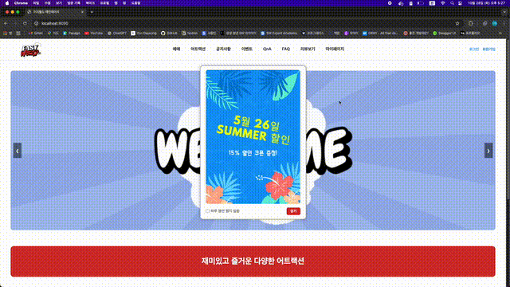
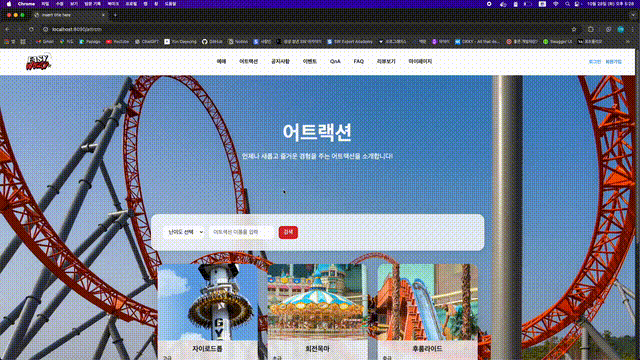
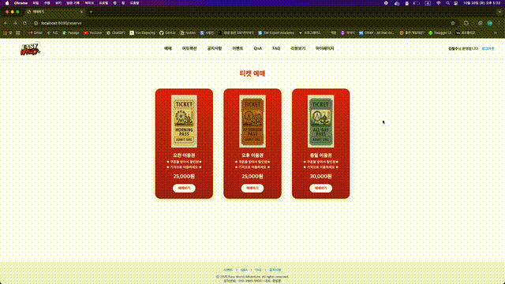
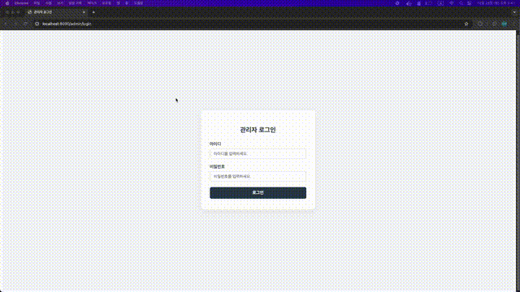
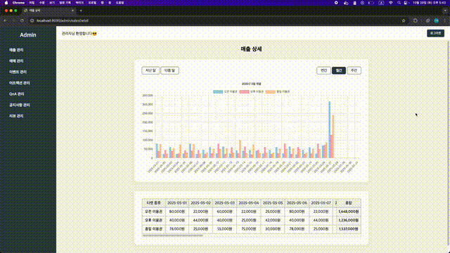
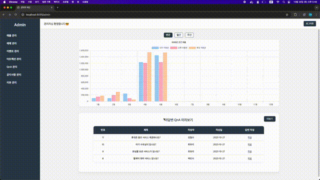
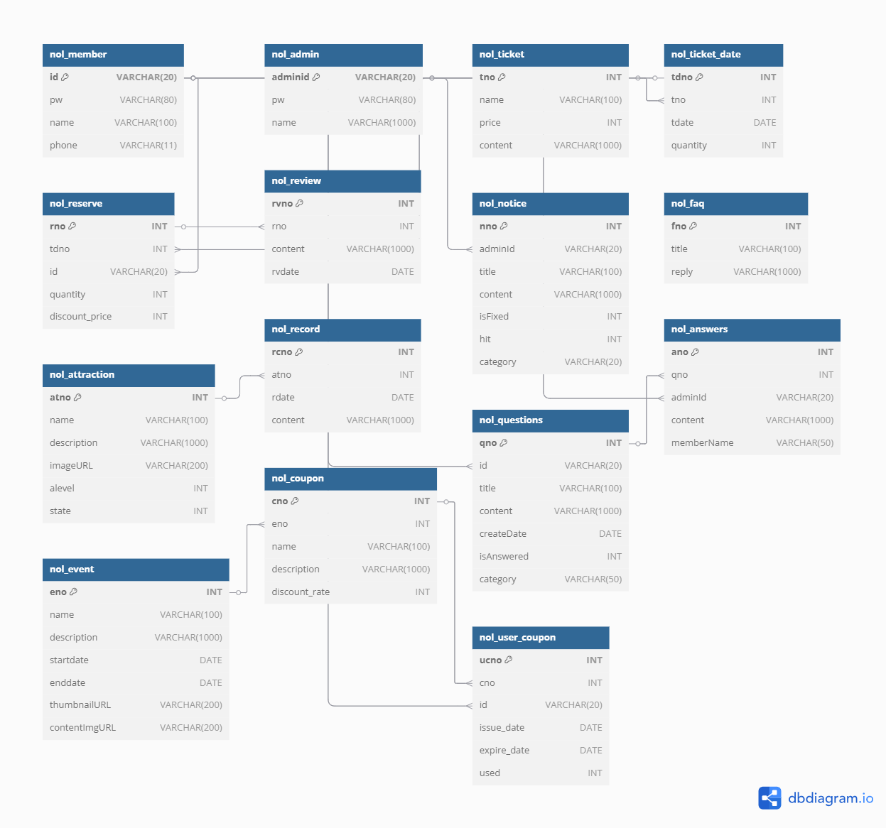

# Easy World - 놀이공원 온라인 티켓 예매 시스템

- 유형: 팀 프로젝트(4인)
- 기간: 2025.05.21 ~ 2025.05.27
- 개발 환경: Spring Boot 기반 웹 애플리케이션

## 📌 프로젝트 개요
- 놀이공원 'Easy World'의 온라인 티켓 예매 및 관리 시스템
- 관리자와 일반 사용자 기능을 분리하여 운영
- 이벤트, 공지사항, 리뷰, FAQ 등 다양한 부가 기능 포함

## 👥 팀원 소개
| 이름           | 담당 기능                                                        |
|---------------|------------------------------------------------------------------|
| 류창훈 (팀장)   | 예매 및 쿠폰 사용 기능, 예매 목록 조회, 마이페이지, 이벤트 팝업, 쿠폰 등록(관리자) |
| 윤다영         | 로그인/회원가입, 비밀번호 암호화, 이벤트 등록/수정(관리자), 매출 차트/테이블(관리자) |
| 이지용         | 공지사항/질문 CRUD 및 검색 기능, 질문 등록/답변, 공지사항/질문 관리(관리자) |
| 백은서         | FAQ, 어트랙션/리뷰 CRUD, 어트랙션 다중검색 기능, 어트랙션/리뷰 관리(관리자) |

## 🛠️ 기술 스택
- **Back-end**: Java 21, Spring Boot, MyBatis
- **Front-end**: HTML, CSS, JavaScript, JSP
- **Database**: Oracle DB
- **Communication & Tools**: GitHub, Git Desktop, Notion, Eclipse

## ✨ 주요 기능
### 👤 사용자
- 티켓 예매(날짜 및 수량, 쿠폰 선택)
- 이벤트 조회 및 쿠폰 발급
- 어트랙션 조회 및 다중 검색
- 게시판(공지사항, QnA) 작성
- 리뷰 작성

### 🛠️ 관리자
- 매출 차트 및 테이블 조회
- 미답변 QnA 조회 및 답변 작성
- 이벤트 등록 및 쿠폰 발급
- 어트랙션/공지사항/리뷰 관리

## 🖥️ 주요 화면
### 👤 사용자
| 메인화면 | 어트랙션 | 티켓 예매 |
| --- | --- | --- |
|  |  |  |

### 🛠️ 관리자
| 관리자 로그인 | 관리자 매출 관리 | 관리자 QnA 관리 |
| --- | --- | --- |
|  |  |  |

## 📚 DB 설계


> ERD 이미지 원본: [images/easyworld_erd.png](images/easyworld_erd.png)

## ⚙️ 환경 설정
> 아래 내용을 참고하여 `src/main/resources/application.properties` 파일을 생성한 후 실행해주세요.

```properties
spring.application.name=[your_project_name]

server.port=8090

spring.mvc.view.prefix=/WEB-INF/views/
spring.mvc.view.suffix=.jsp

# Oracle DB 설정
spring.datasource.driver-class-name=oracle.jdbc.OracleDriver
spring.datasource.url=jdbc:oracle:thin:@localhost:1521:xe
spring.datasource.username=[your_db_username]
spring.datasource.password=[your_db_password]

# mybatis
mybatis.mapper-locations=classpath:mybatis/mapper/**/**.xml
mybatis.type-aliases-package=com.example.nol_project.dto
```

> 사용자 페이지, 관리자 페이지 접속 링크는 아래를 참고해주세요. 
- 사용자 페이지: [http://localhost:8090](http://localhost:8090)
- 관리자 페이지: [http://localhost:8090/admin](http://localhost:8090/admin)

## 🔗 참고 링크
- 노션: [https://succulent-nation-72b.notion.site/EASY-WORLD-1fb7abaf641680318d4dd25fd75f19e7?source=copy_link](https://succulent-nation-72b.notion.site/EASY-WORLD-1fb7abaf641680318d4dd25fd75f19e7?source=copy_link)
